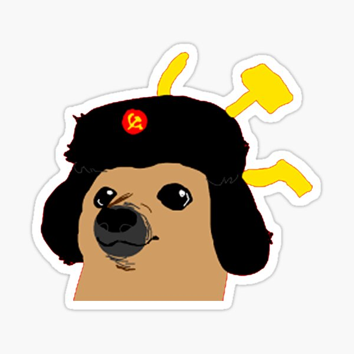
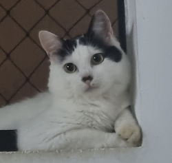

# Dogito 🐕



### A custom bot for Cãomunista Gaming Talk discord server.
Dogito is a custom bot made for a discord server that my friends created. The goal was to develop a versatile Discord bot that could be configured to perform a variety of tasks based on our specific requirements. It was built for <strong>PERSONAL</strong> use only, so it is not available to be added to other servers, but feel free to use it as a base to build your own Discord bot. 


## 🐾 Current and Next Steps

The project is still under development and the next updates will focus on the following tasks:

- [x] Give roles according to the reaction emote;
- [x] Plays music by giving a music link from Youtube;
- [x] Plays music by giving a playlist link from Youtube;
- [ ] Allow slash commands;
- [ ] Establish economy on the server;

## 🥩 Prerequisites

Before you begin, make sure you have installed the following tools:

- [Miniconda](https://docs.anaconda.com/free/miniconda/) (24.4.0)

## 🍖 Installing

To install the application, follow these steps:

1. Create an virtual enviroment using conda and activate it:
```
conda create --name dogito python=3.10.14
conda activate dogito
```

2. Install the dependecies with pip:
```
pip install -r .\requirements.txt
```

3. Populate the .env with the Discord Token:
```
DISCORD_TOKEN=write here your token
```

## 🐶 Running Dogito

To start the bot you just need to execute the main.py file, like this:

```
python main.py
```

## 🐺 Collaborators

We thank the following people who contributed to this project:

<table>
  <tr>
    <td align="center">
      <a href="https://github.com/vannisson" title="Vannisson Github Profile">
        <br>
        <sub>
          <b>Vannisson</b>
        </sub>
      </a>
    </td>
  </tr>
</table>

## 🐩 Licença

Esse projeto está sob licença. Veja o arquivo [LICENÇA](LICENSE.md) para mais detalhes.